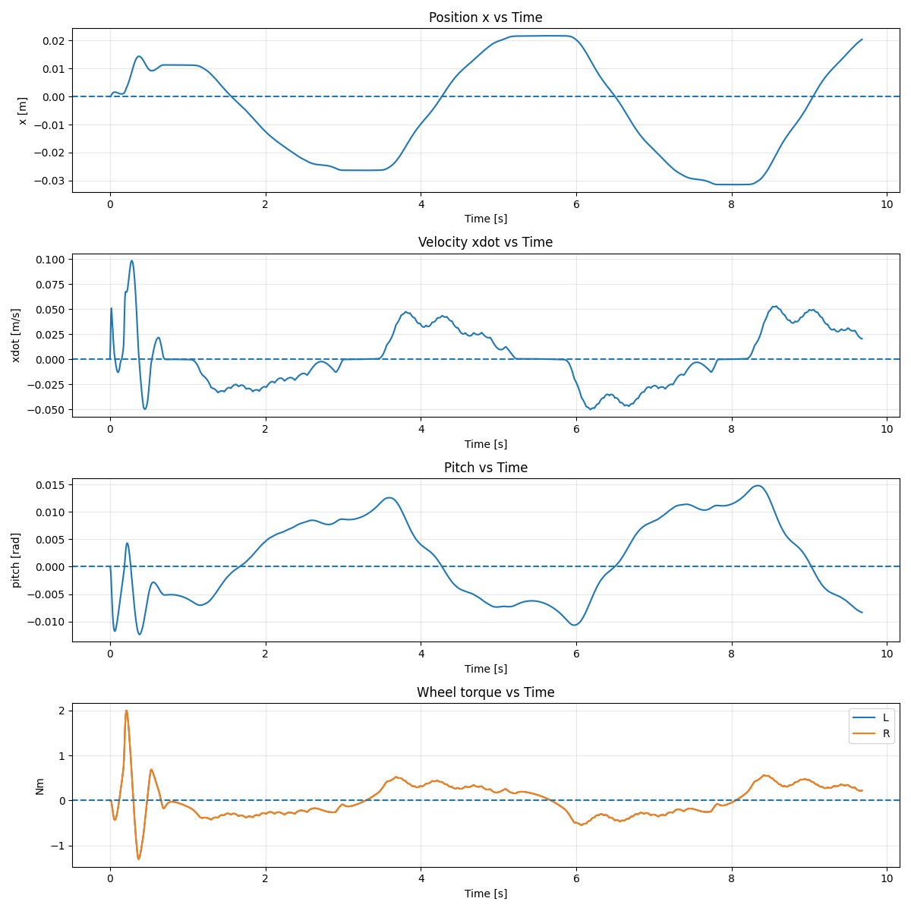
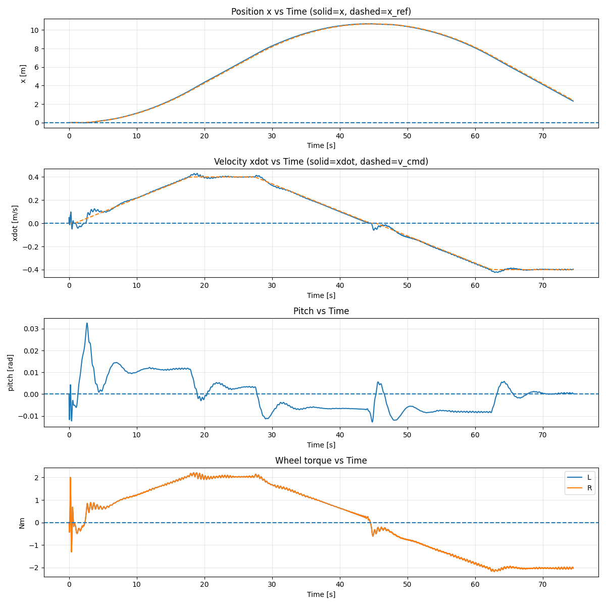

兩種控制模式：

1. **平衡模式**：系統只負責讓裝置維持穩定直立、不倒。
2. **平衡 + 速度控制模式**：在維持平衡的同時，加入前進/後退（或加減速）的控制。

---

### 1. 平衡控制

簡介：
- 只做姿態穩定控制
- 讓系統在無外力干擾下仍維持直立
- 可用來驗證基本控制器是否設計正確

---

### 2. 平衡 + 加速度控制

簡介：
- 在維持平衡的前提下，加入速度/位置/加速度的控制
- 例如：讓車子在指定方向加速前進或減速停止
- 展示系統在動態運動時仍能保持穩定
